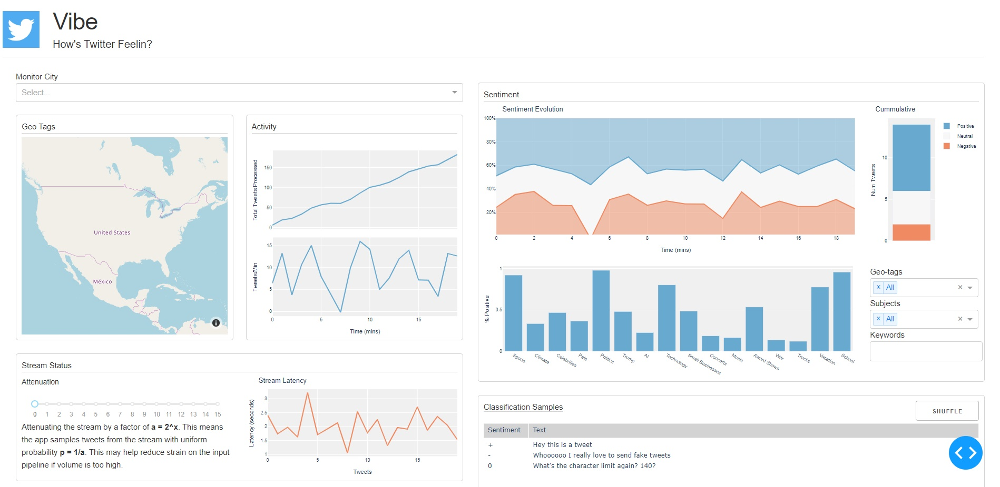

# Streaming Sentiment from Twitter

## Objective:
Incorportate data retrieval, processing, prediction, and representation in a "full-stack" analytics project using Spark streaming and ML with visualization in a Plotly dashboard.

## Overview:

#### Motivation

Twitter is a gold-mine for text data encoded with the thoughts of the world at any given time, and one of the most important ways to analyze this data is sentiment analysis. Finding the sentiment of tweets allows one to track how people feel about something *in real time*. This is extremely powerful, and by filtering by subject, brand, keyword, etc., one can extract a lot meaningful information. These insights are especially important to companies monitoring online conversation, responding to users when the there's a problem or tracking the buzz around a new product or promotion.

#### Dashboard

Since the real-time exploration of sentiment is such a powerful tool, I wanted users of my sentiment analysis pipeline to be able to track and extract insights from its classifications in real-time as well. I designed dashboard below with the following features:
<br><br>
<br>
* Filter the stream to a particular city
* Explore the geographical distribution of geo-tags in tweets. Filtering by geo-tag allows one to see the sentiment of people talking about some location.
* Monitor the volume of the stream to gauge twitter activity
* Attenuate the stream if volume is too high for processing resources
* Filter by subject (as determined by Latent Drichlet Allocation), geo-tag, or keyword in a tweet
* View cummulative sentiment, or observe how sentiment evolved over time
* View sentiment by subject of the tweet
* See classification results first-hand

This dashboard is hosted in the web browser as a ```Dashapp```. All the plots are dynamic ```Plotly``` plots that allow for drill-down and hover-stats. The dashboard will be connected to the output of the Spark stream by SQL table. Results from the table will be recompiled and presented on some update schedule (~minute).

## Spark Pipeline


Spark has pretty neat feature in "pipelines" that allow one to package data-preprocessing and prediction into one saveable unit. This greatly simplified the process of setting up an input pipeline for sentiment classification which typically includes using the correct tokenizer, featurizing frequent tokens, and normalizing with TFIDF. Saving, loading, and coordinating this pre-processing pipeline is usually combersome and makes adjusting the pipeline difficult. With Spark pipelines, I was able to train and validate many different pipeline and model configurations to find the most successful classifier. Now, I can simply load and apply my trained pipeline to raw tweet data with one line of code.

#### The Model

I benchmarked many different featurization and modeling strategies on 60,000 training tweets, then selected the most powerful classifier via area under ROC, widely viewed as the best metric for measuing classifier strength. The strategies I tested are shown below:

| Model | Featurization | Hyperparameters tuned | Optimal Params | test AUC |
|-------|---------------|-----------------------|----------------|-----|
| Logistic Regression | unigram bag-of-words,<br>doc-length normalized,TFIDF | Elastic net, regularization, vocab size | 0.5, 0.01, 20000 | 8.33 |
| Logistic Regression | bigram bag-of-words, same as above | same as above | 0.5, 0.1, 20000 | 0.806 |
| Logistic Regression | trigram bag-of-words, same | same | 0.5, 0.1, 20000 | 0.711 |
| Logistic Regression | unigram and bigrams,<br>concatenated seperate<br>pipelines for unigrams and bigrams | same | 0.5, 0.01, 20000 | 0.837 |
| Niave Bayes | bag-of-words | smoothing | NA | 0.54 |
| Multilayer Perceptron | unigram + bigram bag-of-words | NA | NA | 0.79 |

Though the concatenated unigram and trigram bag-of-words featurization with logistic regression performed the best, the slight gain over the unigram-only LR model did not justify the increased complexity. 

#### Evaluation

I evaluated the unigram logistic regression model on a test set that contained positive, negative, and neutral sentiments, which was different from the train set, which only had positive and negative samples. Because my training set was binary, I could not train a 3-class one-vs-rest classifier, so I needed to extend my model to a 3-class setting using threshold tuning. In Figure 1 are ROC curves where I compared the classifiers stength in discriminating between negative and neutral, then positive and neutral tweets. The AUCs were 0.832 and 0.797, respectively, clearly demonstrating the classifier was better at distinguishing negative tweets from neutral than positive.


Figure 1. ROC curves, (left) negative vs. neutral tweets, AUC=8.32, (right) positive vs. neutral tweets, AUC=0.797.<br>

Based off these curves, I decided to neatly place the thresholds for negative classification at p < 0.33, and for positive classification at p > 0.66. This generated the confusion matrix below. This classifier is strong enough for rough sentiment overviews on high-volume data like streams, but would need to be improved for more granular analysis applications. 

<br>
Figure 3. Confusion matrix. <br>

Precision and recall for each classes is shown below, classified as one-to-rest:

| Sentiment | Precision | Recall | F1 |
|-----------|-----------|--------|----|
| Negative   | 0.748 | 0.58 | 0.654 |
| Neutral  | 0.34 | 0.48 | 0.37 |
| Positive | 0.605 | 0.615 | 0.606 |

Reiterating the conclusion of the ROC curves, the thresholds I've chosen yield similar recalls for positive and negative tweets, but the classifier has higher sensitivity for negative sentiment. Perhaps the boundaries I've chosen are too stringent for negative tweets, but this could be changed depending on the applications for this app.

I suspect the Bag-of-words model does not perform well on tweet data because the language is colloqial, containing sarcasm, idioms, and rapidly-changing subjects. Also, the tweets are very short and do not provide the same opinion reinforcement as multiple sentences, and by extension, more words to bag, that a typical product review might. These factors combine to make the order of words an important feature in classifying the sentiment of a tweet, which suggests I should use an RNN. 

While an RNN would likely be more accurate, I stand by my model choice because logistic regression inference time is much faster, which is necessary to keep up with the stream. By virtue of processing a higher volume of tweets in the same timeframe, the logistic regression model can accurately assess population sentiment even if less accurate in classifying individual tweets. 


## The App

The App consists of four components:
1. Python wrapper for twitter stream object
2. Spark pipeline. Interfaces with python wrapper through local TCP socket.
3. Saves result of pipeline to Apache Arrow intermediary. Arrow dataframe is called by dashboard on updates.
4. Dash dashboard presents the collected data to the user with interactive plots.
